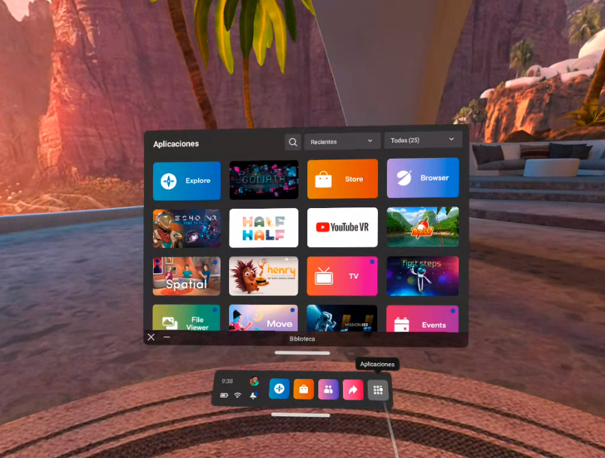
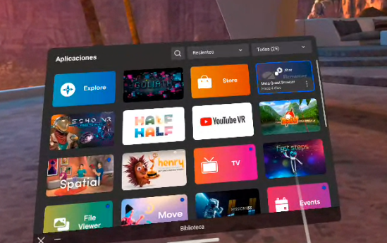

## Práctica 12. Un primer contacto con Oculus Quest 2

### Contenidos

[Primeros pasos](#121-primeros-pasos)  
[Galería](#122-galería)  

### 12.1 Primeros pasos

Si todo va bien, tras arrancar probablemente te pedirá definir el sistema guardián, para interactuar con mayor seguridad con tu entorno cercano.

Posteriormente deberías ver un menú similar a

  
 *Interfaz de usuario*

Es probable que tengas que conectarte a la red para algunas actividades, puedes hacewrlo con la red ULPGC. Y definir la [zona de juego](https://youtu.be/zh5ldprM5Mg). Tras ello, en el menú inferior, la zona derecha te permite ir a las aplicaciones instaladas. La primera aplicación sugerida es *first steps*, que vviene instalada de fábrica, y hace un recorrido por las posibilidades de los controladores.

Si quisieras compartir pantalla al PC
- En PC acceder a https://www.oculus.com/casting
- E gafas
  - Botón Oculus
  - Seleccionar transmitir
  - Elegir ordenador

### 12.1 Galería

He instalado un par de aplicaciones adicionales

- Aplicaciones instaladas
  - ISS Mission
  - Space explorers, meterial producido por Felix & Paul Studios, uno de sus documentales 360 que resultan interesantes de ver
  - Youtube VR

Otras aplicaciones que he probado, pero habría que instalar en esteas gafas son:

- Trypp
- Goliath: Playing with reality. Un documental ganador del permio al mejor trabajo inmersivo en el festival de Venecia de 2021. Estima al menos 20 minutos de experiencia

El botón más a la izquierda, el azul, de la ventana inferior, te permite explorar. Accediendo a la sección *Entretenimiento tienes acceso a vídeos enbvolventes entre otras cosas. Busca y prueba.

Para acceder a páginas web, podemos hacer uso de la aplicación *Browser*

  
 *Seleccionando un aplicación*

Sugerir una visita a:
  - MonRider.xyz en el navegador, recuerda pasar a modo VR (abajo a la derecha)
  - [p5.xr examples+](https://p5xr.org/#/quick-start/examples)
  - [Three.js xamples](https://threejs.org/examples/?q=webxr) y busca webxr
  - [WebXR sample spages](https://immersive-web.github.io/webxr-samples/)

Recuerda activar el modo VR en la web a la que accedes.

<!---
---------------------

https://www.storyfutures.com

Video 360 en processing

https://discourse.processing.org/t/viewing-360-degree-videos/25085

hansdfree360 y vídeo
https://glitch.com/embed/#!/embed/handsfree-youtube-360?path=README.md%3A1%3A0&previewSize=100
En glitch
https://glitch.com/embed/#!/embed/handsfree-youtube-360?path=README.md%3A1%3A0&previewSize=100
Otros proyectos
https://glitch.com/@ozramos

https://github.com/tracerstar/processing-360-video

360 and oculus
https://www.reddit.com/r/OculusQuest/comments/f7rara/view_gopro_max_360_files_on_the_quest/

Resoluciones Oculus
https://creator.oculus.com/blog/encoding-high-resolution-360-and-180-video-for-oculus-go/

Gopro max hevc codec missing
https://www.youtube.com/watch?v=FeYlyzy1r7c
Me dice dodec failed tras inatalar

Handbrake para convertir
https://handbrake.fr/rotation.php?file=HandBrake-1.5.1-x86_64-Win_GUI.exe
Uso un preset para las resoluciones tgomado de
https://www.viar360.com/how-to-compress-video-files-360-vr-with-handbrake/
Preset for Handbrake al visualizar con VLKC sigo sin poder moverme 360...

--->
