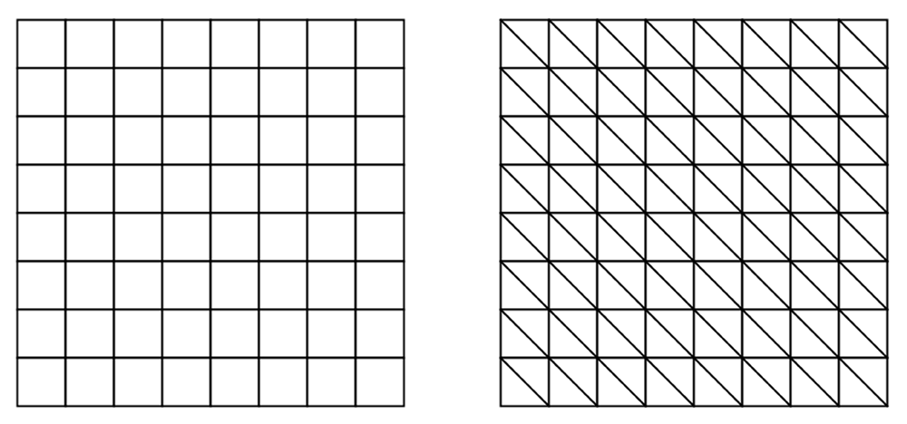
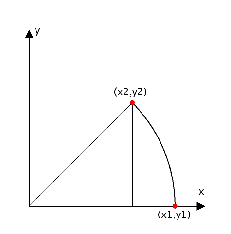
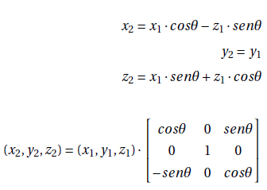
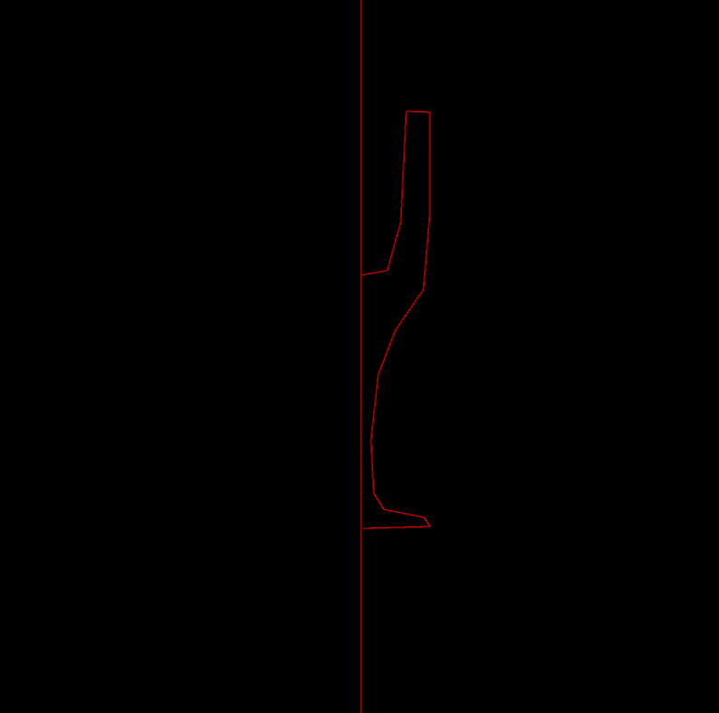
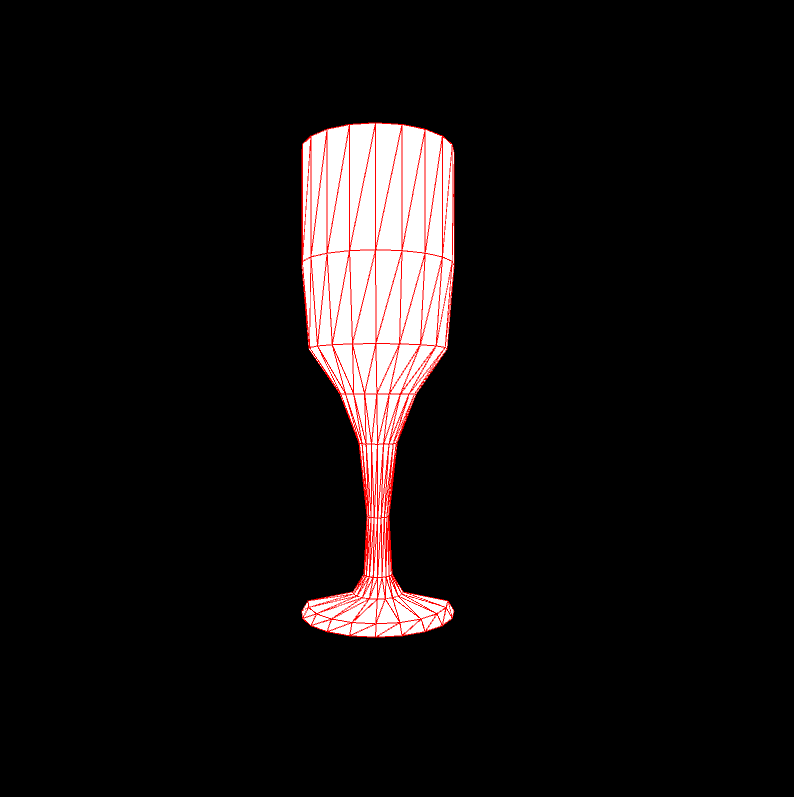

## Práctica 2. Superficie de revolución

### Contenidos

[PShape](#21-pshape)  
[P3D](#22-p3d)  
[Sólido de revolución](#23-sólido-de-revolución)  
[Tarea](#24-tarea)  
[Referencias](#referencias)

A partir de esta práctica, la mayor parte de los listados de código Processing mostrados en el guion se proporcionan también a través del
[enlace github](https://github.com/otsedom/CIU) para facilitar su descarga y reproducibilidad. En caso de estar disponible, en la cabecera del listado se indica el nombre del proyecto Processing.

### 2.1 PShape

La práctica anterior describe las primitivas básicas 2D para el dibujo de objetos tales como rectángulos y elipses. Una opción más avanzada para la creación de formas arbitrarias es hacer uso de variables  [*PShape*](https://processing.org/reference/PShape.html), que por otro lado permiten acelerar el proceso de dibujado, aspecto relevante en particular cuando los objetos crecen en complejidad.  

El siguente listado sigue las pautas descritas en la mencionada primera práctica, haciendo uso de del comando *rect* para dibujar un rectángulo, que en este caso acompaña al movimiento del puntero sobre la ventana.

```
void setup() {
  size(400, 400);
}
void draw() {
  background(50);
  stroke(255);
  fill(127);
  rect(mouseX,mouseY,100,50);
}
```

Como primer ejemplo ilustrativo de una variable *PShape*, el siguiente código muestra uan posible forma de obtener el mismo resultado sin necesidad de la función *rect* dentro del método *draw*, si bien requiere el uso de la traslación 2D con la función *translate* para desplazar el objeto *PShape* creado.

**Processing** [p2_rectanglev0](https://github.com/otsedom/CIU/tree/master/P2/p2_rectanglev0)
```
PShape rectangle;

void setup() {
  size(400,400,P2D);
  //La forma
  rectangle = createShape(RECT,-50,-25,100,50);
  //Aspectos de dibujo
  rectangle.setStroke(color(255));
  rectangle.setStrokeWeight(4);
  rectangle.setFill(color(127));
}
void draw() {
  background(50);
  //Situamos en el puntero
  translate(mouseX, mouseY);
  shape(rectangle);
}
```

La modificación de características de color de una *PShape* hace uso de los métodos *setFill*,  *setStroke*,  *setStrokeWeight*, etc. En este sentido, el siguiente listado selecciona el tono de gris de relleno de la forma según la coordenada *x* del puntero.

**Processing** [p2_rectangle](https://github.com/otsedom/CIU/tree/master/P2/P2_rectangle)
```
PShape rectangle;

void setup() {
  size(400,400,P2D);
  rectangle = createShape(RECT,-50,-25,100,50);
  rectangle.setStroke(color(255));
  rectangle.setStrokeWeight(4);
  rectangle.setFill(color(127));
}
void draw() {
  background(50);
  translate(mouseX, mouseY);
  rectangle.setFill(color(map(mouseX, 0, width, 0, 255)));
  shape(rectangle);
}
```


La flexibilidad ofrecida por las variables tipo *PShape* aparece al poder definir los vértices que componen el objeto de forma arbitraria. El tutorial disponible en la [web](https://processing.org/reference/PShape.html) incluye una adaptación del ejemplo de una estrella (ver original en *Archivo->Ejemplos->Topics->Create Shapes->PolygonPShape*) especificando los vértices que delimitan a la forma entre llamadas a *beginShape* y *endShape*. En este ejemplo concreto, la llamada a  *endShape* con *CLOSE* como argumento para forzar el cierre de la línea poligonal.

**Processing** [p2_estrella](https://github.com/otsedom/CIU/tree/master/P2/P2_estrella)
```
PShape star;

void setup() {
  size(400,400,P2D);

  // La variable
  star = createShape();
  star.beginShape();
  // El pincel
  star.fill(102);
  star.stroke(255);
  star.strokeWeight(2);
  // Los puntos de la forma
  star.vertex(0, -50);
  star.vertex(14, -20);
  star.vertex(47, -15);
  star.vertex(23, 7);
  star.vertex(29, 40);
  star.vertex(0, 25);
  star.vertex(-29, 40);
  star.vertex(-23, 7);
  star.vertex(-47, -15);
  star.vertex(-14, -20);
  star.endShape(CLOSE);
}

void draw() {
  background(51);
  // Movimiento con el puntero
  translate(mouseX, mouseY);
  // Dibujamos
  shape(star);
}
```

Observar que al usar *beginShape* y *endShape*, los métodos para especificar las propiedades de color son  *fill*,  *stroke*,  *strokeWeight*. Según l.a documentación de Processing, tras la creación, únicamente puede utilizarse *setFill*.  

p5js no dispone del comando *createShape* pero sí *beginShape* y *endShape*, una adaptación para dibujar la estrella la vemos en el siguiente listado, si bien recomendar el tutorial del [enlace](https://programmingdesignsystems.com/shape/custom-shapes/index.html) así como el [videotutorial](https://programmingdesignsystems.com/shape/custom-shapes/index.html) por The Coding Train:  

**p5js**
```
function setup() {
  createCanvas(400,400,P2D);  
}

function draw() {
  background(51);
  // Movimiento con el puntero
  translate(mouseX, mouseY);
  // Dibujamos
  // La variable
  beginShape();
  // El pincel
  fill(102);
  stroke(255);
  strokeWeight(2);
  // Los puntos de la forma
  vertex(0, -50);
  vertex(14, -20);
  vertex(47, -15);
  vertex(23, 7);
  vertex(29, 40);
  vertex(0, 25);
  vertex(-29, 40);
  vertex(-23, 7);
  vertex(-47, -15);
  vertex(-14, -20);
  endShape(CLOSE);
}
```

A partir de la forma de estrella, el ejemplo
 *PolygonPShapeOOP2* (*Archivo->Ejemplos->Topics->Create Shapes*)
 hace uso de la clase *Polygon*, ver más abajo, para mostrar  múltiples estrellas en movimiento vertical descendente. La clase *Polygon* se encarga de definir la posición y  velocidad inicial de cada forma, estrella en este ejemplo, añadida a la lista de objetos.

**Processing**
```
ArrayList<Polygon> polygons;

void setup() {
  size(640, 360, P2D);

  // La forma
  PShape star = createShape();
  star.beginShape();
  star.noStroke();
  star.fill(0, 127);
  star.vertex(0, -50);
  star.vertex(14, -20);
  star.vertex(47, -15);
  star.vertex(23, 7);
  star.vertex(29, 40);
  star.vertex(0, 25);
  star.vertex(-29, 40);
  star.vertex(-23, 7);
  star.vertex(-47, -15);
  star.vertex(-14, -20);
  star.endShape(CLOSE);

  // Lista de objetos
  polygons = new ArrayList<Polygon>();

  // Lista de objetos PShape
  for (int i = 0; i < 25; i++) {
    polygons.add(new Polygon(star));
  }
}

void draw() {
  background(255);

  // Dibujamos
  for (Polygon poly : polygons) {
    poly.display();
    poly.move();
  }
}
```

**Processing**
```
class Polygon {
  // The PShape object
  PShape s;
  // The location where we will draw the shape
  float x, y;
  // Variable for simple motion
  float speed;

  Polygon(PShape s_) {
    x = random(width);
    y = random(-500, -100);
    s = s_;
    speed = random(2, 6);
  }

  // Simple motion
  void move() {
    y += speed;
    if (y > height+100) {
      y = -100;
    }
  }

  // Draw the object
  void display() {
    pushMatrix();
    translate(x, y);
    shape(s);
    popMatrix();
  }
}
```

### 2.1 P3D

Los ejemplos mostrados en el apartado previo trabajan en 2D. Processing ofrece diversos modos de reproducción como son: SVG, PDF, P2D y P3D. Los dos últimos, P2D y P3D, hacen uso de hardware compatible con OpenGL, permitiendo mayor rendimiento en la salida gráfica. P2D, que ha aparecido en alguno de los listados previos, es el modo de reproducción optimizado para dos dimensiones, mientras que [P3D](https://processing.org/tutorials/p3d) nos permite trabajar en tres dimensiones. Para ambos modos, la calidad del resultado puede configurarse con los métodos  *smooth* y *hint*, sugerir consultar la documentación. Como punto de partida en 3D, existen formas tridimensionales básicas como la esfera y el prisma, respectivamente  los métodos *sphere* y *box*:

**Processing** [p2_formas3d](https://github.com/otsedom/CIU/tree/master/P2/P2_formas3d)
```
size(640, 360, P3D);
background(0);

noFill();
stroke(255);

//Prisma
translate(width*0.2, height*0.15, 0);
box(100);

//Esfera
translate(width/2, height*0.35, 0);
sphere(100);
```

Sin embargo, la mayor potencia y flexibilidad viene dada por poder definir objetos a través de vértices arbitrarios.
Como primer ejemplo ilustrativo, el siguiente código muestra una pirámide formada por cuatro caras triangulares, cada una con 3 puntos tridimensionales. Al mover el puntero observamos el efecto de la proyección en perspectiva, tras desplazar el origen de coordenadas al centro de la ventana.

**Processing** [p2_piramide](https://github.com/otsedom/CIU/tree/master/P2/P2_piramide)
```
PShape obj;

void setup() {
  size(600, 600,P3D);

  // La variable
  obj=createShape();
  // El pincel
  obj.beginShape();
  obj.noFill();
  // Puntos de la forma
  obj.vertex(-100, -100, -100);
  obj.vertex( 100, -100, -100);
  obj.vertex(   0,    0,  100);

  obj.vertex( 100, -100, -100);
  obj.vertex( 100,  100, -100);
  obj.vertex(   0,    0,  100);

  obj.vertex( 100, 100, -100);
  obj.vertex(-100, 100, -100);
  obj.vertex(   0,   0,  100);

  obj.vertex(-100,  100, -100);
  obj.vertex(-100, -100, -100);
  obj.vertex(   0,    0,  100);
  obj.endShape();
}

void draw() {
  background(255);
  //Movemos con puntero
  translate(mouseX, mouseY);
  //Muestra la forma
  shape(obj);
}
```


Cuando la pareja *beginShape*-*endShape* no tiene argumentos, se asume una serie de vértices consecutivos que conforman una línea poligonal. La especificación de un parámetro a la hora de crear la forma permite indicar el tipo de elementos que definen los vértices a continuación:
*POINTS*, *LINES*, *TRIANGLES*, *TRIANGLE_FAN*, *TRIANGLE_STRIP*,*QUADS*, o *QUAD_STRIP* (más detalles en este [enlace](https://processing.org/reference/beginShape\_.html)):

- *beginShape*-*endShape(CLOSE)*: Cierra la línea poligonal, uniendo el último vértice con el primero, aplicando el color de relleno, como en el listado~\ref{code:processing-pira}.
- *beginShape(POINTS)*-*endShape*: Cada vértice es un punto, no se conectan con líneas.
- *beginShape(LINES)*-*endShape*:
Cada dos puntos definen un segmento independiente.
- *beginShape(TRIANGLES)*-*endShape*: Cada grupo de tres puntos define un triángulo, aplicando relleno.
- *beginShape(TRIANGLE_STRIP)*-*endShape*: Los triángulos no son independientes entre sí, cada nuevo vértice compone un triángulo con los últimos dos vértices del triángulo anterior. Aplica relleno.
- *beginShape(TRIANGLE_FAN)*-*endShape*: El primer vértice está compartido por todos los triángulos. Aplica relleno.
- *beginShape(QUADS)*-*endShape*: Cada cuatro puntos definen un polígono. Aplica relleno.
- *beginShape(QUAD_STRIP*-*endShape*: Similar al antereios, si bien se reutilizan los dos últimos vértices del polígono anterior. Aplica relleno.

Como ejemplo de creación de una forma arbitraria, el siguiente listado muestra una serie enlazada de triángulos creada con la opción *TRIANGLE_STRIP*.

**Processing** [p2_trianglestrip](https://github.com/otsedom/CIU/tree/master/P2/P2_trianglestrip)
```
PShape obj;

void setup() {
  size(600, 600,P3D);

  // La variable
  obj=createShape();
  // El pincel
  obj.beginShape(TRIANGLE_STRIP);
  obj.fill(102);
  obj.stroke(255);
  obj.strokeWeight(2);
  // Puntos de la forma
  obj.vertex(50, 50, 0);
  obj.vertex(200, 50, 0);
  obj.vertex(50, 150, 0);
  obj.vertex(200, 150, 0);
  obj.vertex(50, 250, 0);
  obj.vertex(200, 250, 0);
  obj.vertex(50, 350, 0);
  obj.vertex(200, 350, 0);
  obj.vertex(50, 450, 0);
  obj.vertex(200, 450, 0);
  obj.endShape();

}
void draw() {
  background(255);
  //Movemos con puntero
  translate(mouseX, mouseY);
  //Muestra la forma
  shape(obj);
}
```

La variante mostrada a continuación modifica el valor de la coordenada *z* de varios vértices. Al ejecutar, observa el efecto de la perspectiva sobre los vértices más alejados.

**Processing**
```
PShape obj;

void setup() {
  size(600, 600,P3D);

  // La variable
  obj=createShape();
  // El pincel
  obj.beginShape(TRIANGLE_STRIP);
  obj.fill(102);
  obj.stroke(255);
  obj.strokeWeight(2);
  // Puntos de la forma
  obj.vertex(50, 50, 0);
  obj.vertex(200, 50, 0);
  obj.vertex(50, 150, 0);
  obj.vertex(200, 150, -100);
  obj.vertex(50, 250, -100);
  obj.vertex(200, 250, -100);
  obj.vertex(50, 350, -200);
  obj.vertex(200, 350, -200);
  obj.vertex(50, 450, -200);
  obj.vertex(200, 450, -200);
  obj.endShape();

}
void draw() {
  background(255);
  //Movemos con puntero
  translate(mouseX, mouseY);
  //Muestra la forma
  shape(obj);
}
```

En p5.js, los gráficos en tres dimensiones requieren la llamada a *createCanvas* con *WEBGL* como modo de reproducción. Adaptando el último ejemplo:

**p5js**
```
function setup() {
  createCanvas(600, 600,WEBGL);
}

function draw() {
  background(255);
  //Movemos con puntero
  translate(mouseX-width/2, mouseY-height/2);
  //Muestra la forma
  // La variable
  beginShape(TRIANGLE_STRIP);
  fill(102);
  stroke(255);
  strokeWeight(2);
  // Puntos de la forma
  vertex(50, 50, 0);
  vertex(200, 50, 0);
  vertex(50, 150, 0);
  vertex(200, 150, -100);
  vertex(50, 250, -100);
  vertex(200, 250, -100);
  vertex(50, 350, -200);
  vertex(200, 350, -200);
  vertex(50, 450, -200);
  vertex(200, 450, -200);
  endShape();
}
```

Si comnparas con el ejemplo processing, probablenmente observarás una diferencia en los parámetros de la función *translate*. Los detalles de la función los dejamos para la siguiente práctica, pero indicar que en p5.js las coordenadas *(0,0)* se corresponden con el centro de la ventana de visualización, a diferencia de Processing que se localiza en la esquina superior izquierda.

En Processing, si en algún momento fuera necesario recuperar los valores de los vértices almacenados en la estructura *PShape*, podremos hacer uso de la función *getVertex*, mientras que *setVertex* permite realizar modificaciones. El listado a continuación modifica un ejemplo previo, para que en cada iteración se muevan aleatoriamente, de forma leve, los vértices haciendo uso de ambas funciones.

**Processing** [p2_trianglestrip_random](https://github.com/otsedom/CIU/tree/master/P2/P2_trianglestrip_random)
```
PShape obj;

void setup() {
  size(600, 600,P3D);

  // La variable
  obj=createShape();
  // El pincel
  obj.beginShape(TRIANGLE_STRIP);
  obj.fill(102);
  obj.stroke(255);
  obj.strokeWeight(2);
  // Puntos de la forma
  obj.vertex(50, 50, 0);
  obj.vertex(200, 50, 0);
  obj.vertex(50, 150, 0);
  obj.vertex(200, 150, 0);
  obj.vertex(50, 250, 0);
  obj.vertex(200, 250, 0);
  obj.vertex(50, 350, 0);
  obj.vertex(200, 350, 0);
  obj.vertex(50, 450, 0);
  obj.vertex(200, 450, 0);
  obj.endShape();

}
void draw() {
  background(255);
  //Movemos con puntero
  translate(mouseX, mouseY);
  //Desplaza aleatoriamente los puntos
  for (int i = 0; i < obj.getVertexCount(); i++) {
    PVector v = obj.getVertex(i);
    v.x += random(-1, 1);
    v.y += random(-1, 1);
    v.z += random(-1, 1);
    obj.setVertex(i, v);
  }
  //Muestra la forma
  shape(obj);
}
```


### 2.3 Sólido de revolución

La creación de objetos 3D resulta engorrosa al ser necesario disponer de mecanismos para definir los vértices que delimitan el objeto en un escenario tridimensional, y esto debe hacerse sobre una pantalla bidimensional. Una posible simplificación del proceso viene dada a través de la creación de un objeto por medio de superficies de barrido o revolución. En ambos casos, se definen en primer lugar una serie de puntos, que conforman una línea poligonal que generalmente aproxima una curva plana, que bien por sucesivas traslaciones (barrido), o rotaciones (revolución), permiten definir la malla de un objeto tridimensional. De modo ilustrativo, la siguiente figura crea dos objetos utilizando el esquema de revolución, al definir sendos perfiles que se rotan un número determinado de veces, en este caso sobre el eje *y*, para crear el objeto a partir de la unión de  los sucesivos *meridianos* que conforman la malla del objeto.

  
*Creación de objetos con superficies de revolución*

Si presentamos la malla resultante *planchada* sobre un plano, tendría el aspecto de una rejilla rectangular, ver figura izquierda, donde cada polígono o cara está delimitado por cuatro vértices. Habitualmente resulta más interesante trabajar con triángulos, que para la mencionada malla pueden crearse de forma sistemática subdividiendo cada polígono, ver figura derecha.


  
*Ilustración de malla antes y tras triangularizar*


#### 2.1.1 Rotación de un punto 3D

En dos dimensiones la rotación de un punto sobre el plano cartesiano se ilustra:

  
*Rotación 2D de un ángulo θ*

Siguiendo la regla de la mano derecha, al rotar  el punto *p* con coordenadas *(x<sub>1</sub>,y<sub>1</sub>)* un ángulo *θ*, las coordenadas resultantes *(x<sub>2</sub>,y<sub>2</sub>)* tras la rotación serían:  


O su equivalente en forma matricial con premultiplicación:


Extensible de forma análoga a tres dimensiones, donde por simplicidad asumiremos una rotación de un punto alrededor del eje vertical *y*, de forma similar al ejemplo mostrado en la figura anterior. De esta forma, las coordenadas rotadas de un punto 3D rotado un ángulo *θ* sobre el eje *y* siguen las siguientes expresiones:



Una vez que se ha definido el perfil de un sólido de revolución, la obtención de los vértices de dicho sólido requiere repetir, un determinado número de veces,
la rotación de los puntos de dicho  perfil, para obtener los vértices 3D de la malla del objeto. Una correcta conexión de dichos vértices, permite visualizar el volumen del objeto sobre la pantalla.

### 2.4 Tarea

Crear un prototipo que recoja puntos de un perfil del sólido de revolución al hacer clic con el ratón sobre la pantalla. Dicho perfil será utilizado por el prototipo  para  crear un objeto tridimensional por medio de una superficie de revolución, almacenando la geometría resultante en una variable de tipo *PShape*, ver a modo de ilustración la figura. El prototipo permitirá crear sólidos de revolución de forma sucesiva, si bien únicamente se asumirá necesario almacenar el último definido.

  
  
*Perfil y sólido de revolución resultante*

La entrega se debe realizar a través del campus virtual, remitiendo un enlace a un proyecto github, cuyo README sirva de memoria, por lo que se espera que el README:


- identifique al autor,
- describa el trabajo realizado,
- argumente decisiones adoptadas para la solución propuesta,
- incluya referencias y herramientas utilizadas,
- muestre el resultado con un gif animado.

***
Bajo licencia de Creative Commons Reconocimiento - No Comercial 4.0 Internacional
