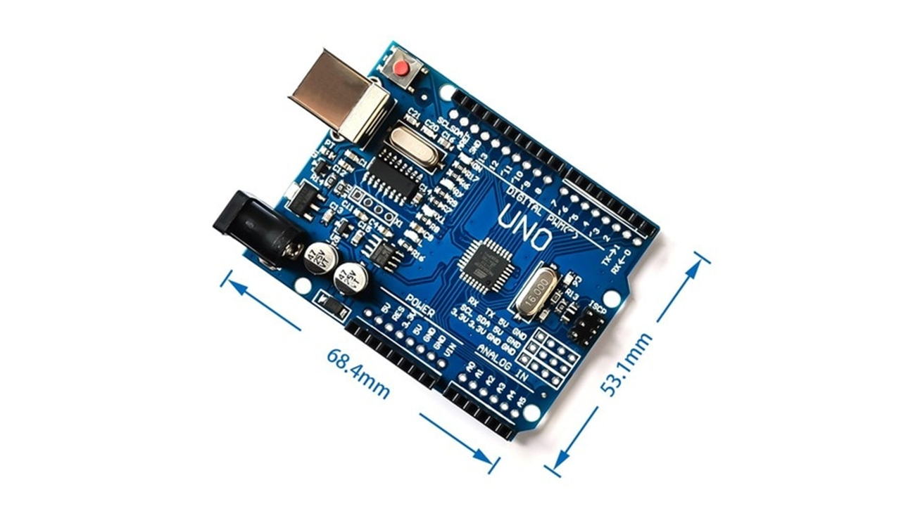
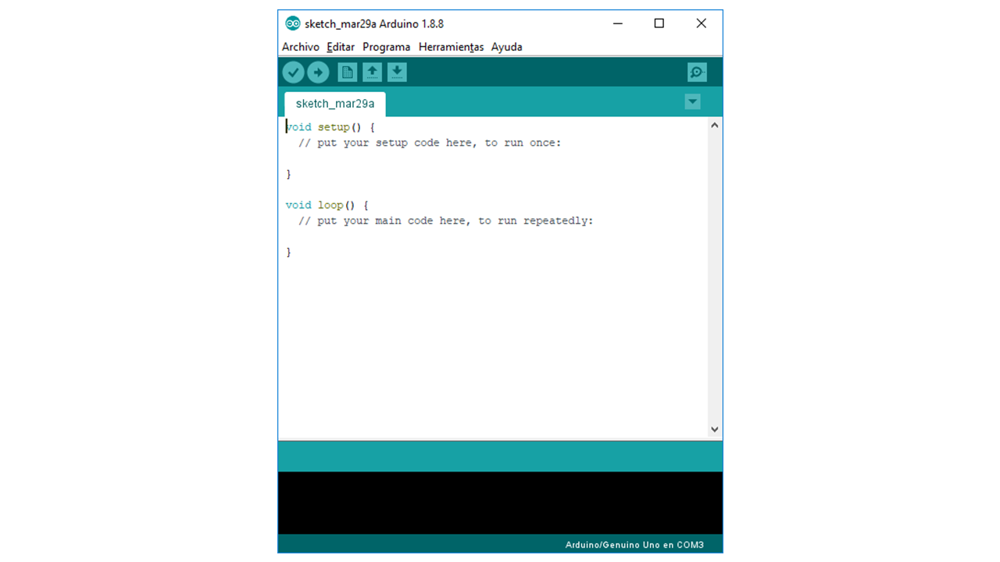

## Práctica 8. Introducción a la programación con Arduino

### Contenidos

[Arduino](#81-arduino)  
[Programación](#82-programación)  
[Algunos recursos útiles](#83-algunos-recursos-útiles)  
[Algunas fuentes adicionales](#84-algunas-fuentes-adicionales)  
[Tarea](#85-tarea)  


### 8.1 Arduino

[Arduino](https://www.arduino.cc/) es una plataforma abierta de hardware/software para facilitar el desarrollo de proyectos que impliquen interacción física con el entorno.

#### 8.1.1 Hardware

El elemento hardware característico es una tarjeta controladora con capacidades de entrada/salida a nivel de puertos analógicos, digitales y comunicaciones seriales.

La unidad básica disponible inicialmente fue el [Arduino UNO](https://docs.arduino.cc/hardware/uno-rev3), que se muestra en la figura. Se trata de una tarjeta microcontroladora basada en el chip ATMega328P (RISC, 8 bit, flash memory 32 Kb, 1 Kb EEPROM) y que cuenta con los siguientes elementos:

- Microcontrolador  
- 14 pines digitales input/output (6 configurables como salidas PWM)  
- 6 entradas analógicas  
- Oscilador de 16 MHz  
- Conexión USB  
- Otros: interfaz serial, alimentación, reset, ICSP  

  
*Tarjeta Arduino UNO*

La familia de tarjetas disponibles ha ido creciendo paulatinamente, de manera que ahora es posible acceder a multitud de alternativas, con una amplia variedad de prestaciones y [características](https://docs.arduino.cc/).

- 101  
- Gemma  
- LilyPad, LilyPad SimpleSnap, LilyPad USB  
- Mega 2560, Mega ADK  
- MKR1000, MKRZero  
- Pro, Pro Mini  
- Uno, Zero, Due  
- Esplora  
- Ethernet  
- Leonardo  
- Mini, Micro, Nano  
- Yùn  
- Arduino Robot  

Junto a estos componentes básicos, existen elementos auxiliares que permiten expandir el sistema con nuevas opciones de comunicación e interacción con una amplia gama de dispositivos sensores/actuadores. Por ejemplo, es posible añadir tarjetas auxiliares para disponer de conexión WiFi, buses industriales, control de motores, etc.

#### 8.1.2 Software

La programación de la tarjeta puede realizarse desde diferentes entornos de desarrollo. Las dos opciones más habituales son la utilización del Arduino Desktop IDE y la versión online. En la figura se muestra el aspecto del entorno de desarrollo en su versión *Desktop*.

  
*IDE Arduino*

El lenguaje de programación estándar es C/C++, aunque existe la posibilidad de utilizar otros lenguajes como Python, Java, Lisp, etc. A nivel de comunicación, es posible interaccionar con la tarjeta desde cualquier lenguaje, puesto que simplemente será necesario enviar/recibir datos a través del puerto serial.

En la [página de referencia software](https://www.arduino.cc/reference/en/) pueden encontrar la descripción de las instrucciones y funciones disponibles en C/C++.

#### 8.1.4  Instalación

La instalación por defecto requiere permisos de administración, y simplemente precisa descargar el fichero adecuado y seguir los pasos indicados. También es posible realizar una instalación a nivel de usuario, aunque en ese caso los *drivers* tienen que instalarse separadamente.

Una vez conectada la tarjeta a través del cable USB, en el IDE debe aparecer identificada con su tipo y número de puerto serial.

### 8.2 Programación

Un programa en Arduino se denomina *sketch} (bosquejo, esquema), y consta de dos funciones principales:

- *setup()* de inicialización, que se ejecuta una única vez al lanzar el programa  
- *loop()* de procesamiento, que se ejecuta por defecto de forma repetitiva.

El ejemplo del listado que se muestra a continuación puede considerarse el "Hola Mundo" de Arduino. El código cambia el estado del LED integrado en la tarjeta alternativamente entre niveles alto y bajo, consiguiendo un efecto de parpadeo con un periodo de un segundo.


```
/*
  This example code is in the public domain.
  http://www.arduino.cc/en/Tutorial/Blink
*/

// the setup function runs once when you press reset or power the board
void setup() {
  // initialize digital pin LED_BUILTIN as an output.
  pinMode(LED_BUILTIN, OUTPUT);
}

// the loop function runs over and over again forever
void loop() {
  digitalWrite(LED_BUILTIN, HIGH);   // turn the LED on (HIGH is the voltage level)
  delay(1000);                       // wait for a second
  digitalWrite(LED_BUILTIN, LOW);    // turn the LED off by making the voltage LOW
  delay(1000);                       // wait for a second
}
```

Para ejecutar el código deberá realizarse la compilación del código y la transferencia a la tarjeta previamente enlazada.

### 8.3 Algunos recursos útiles

#### 8.3.1  Control del tiempo

Un aspecto importante de la interacción con el usuario es el control del tiempo. En Arduino disponemos de una serie de funciones que permiten medir el tiempo transcurrido y definir pausas en la ejecución.

- *delay()*
- *delayMicroseconds()*
- *micros()*
- *millis()*


#### 8.3.2 Interrupciones

En determinadas aplicaciones en las que un programa debe responder con rapidez a un evento determinado, puede ser necesario programar interrupciones. De esta manera se minimiza el riesgo de que algún cambio de estado no sea detectado por el código.

En el ejemplo del listado a continuación se configura una función como rutina de servicio para atender el cambio de estado de un pin de entrada de la tarjeta.

```
const byte ledPin = 13;
const byte interruptPin = 2;
volatile byte state = LOW;

void setup() {
  pinMode(ledPin, OUTPUT);
  pinMode(interruptPin, INPUT_PULLUP);
  attachInterrupt(digitalPinToInterrupt(interruptPin), blink, CHANGE);
}

void loop() {
  digitalWrite(ledPin, state);
}

void blink() {
  state = !state;
}
```

#### 8.3.3 Funciones matemáticas

Operaciones matemáticas básicas:

- *abs()*
- *constrain()*
- *map()*
- *max()*, *min()*
- *pow()}*, *sq()*, *sqrt()*

Trigonometría:

- *cos()*
- *sin()*
- *tan()*

#### 8.3.4 Generación de números aleatorios

En Arduino se puede acceder a un generador de números aleatorios a través de las siguientes funciones:

- *random()*
- *randomSeed()*

#### 8.3.5  Procesamiento de texto

- *Characters*
- *isAlpha()*, *isAlphaNumeric()*
- *isAscii()*
- *isControl()*
- *isDigit()*, *isHexadecimalDigit()*
- *isGraph()*
- *isLowerCase()*, *isUpperCase()*
- *isPrintable()*
- *isPunct()*
- *isSpace()*, *isWhitespace()*


### 8.4 Algunas fuentes adicionales

- [Arduino motor party](http://cmuems.com/2018/60212f/daily-notes/oct-12/arduino/)
- [Openframeworks and arduino](http://openframeworks.cc/documentation/communication/ofArduino/)
- [IoT Devices, Sensors, and Actuators Explained](https://blog.leanix.net/en/iot-devices-sensors-and-actuators-explained)


### 8.5 Tarea

Programar el Arduino de manera que se genere una pulsación de frecuencia variable en el LED integrado en la placa. Deberá producirse una señal senoidal que definirá la envolvente, de manera que cuando dicha señal alcance su valor máximo el LED parpadeará a una cierta frecuencia *freqMax*, mientras que cuando alcance el valor mínimo parpadeará a una frecuencia mínima *freqMin*.

La entrega se debe realizar a través del campus virtual, remitiendo un enlace a un proyecto github, cuyo README sirva de memoria, por lo que se espera que el README:

- identifique al autor o autores,
- describa el trabajo realizado,
- argumente decisiones adoptadas para la solución propuesta,
- incluya referencias y herramientas utilizadas,


***
Bajo licencia de Creative Commons Reconocimiento - No Comercial 4.0 Internacional
